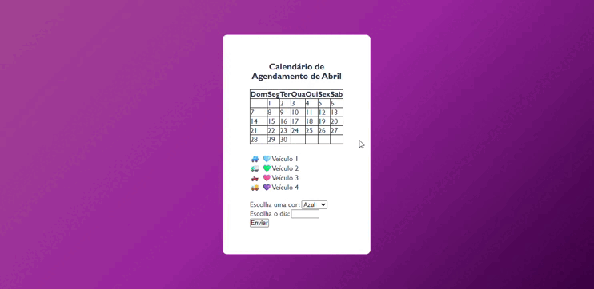
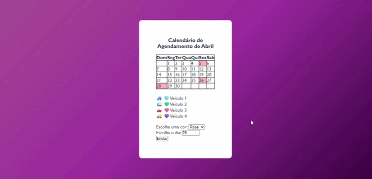
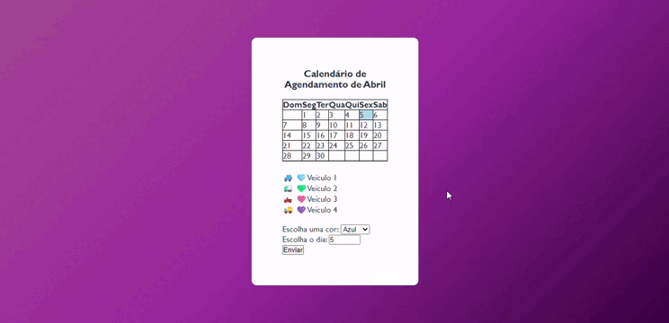

# Calendário e agendamentos de viagens 🚛📦✨
<link rel="stylesheet" href="https://cdn.jsdelivr.net/npm/bootstrap-icons@1.11.3/font/bootstrap-icons.min.css">
   
## Introdução 🚀✨
A proposta desse trabalho foi, criar um Calendário Web para uma empresa de fretes e contratos de caminhões 🚛📦,
essa página irá auxiliar a organizar os dias disponíveis e indisponíveis para viagem, veja a seguir alguns requisitos impostos pelo professor para realização desse trabalho:
* Existem três veìculos disponiveis para transporte;
* Cada veículo sera identificado por uma cor;
* Um veículo não poderá fazer mais de uma viagem por dia;
* Um veículo naõ poderá fazer mais que 3 entregas por mês;

## Interface 🥽✨
### Ao selecionar uma agendamento:

### Ao selecionar mais de 3 agendamentos para um só veículo:

### Ao selecionar uma data já agendade antes:

### Ao selecionar uma data inválida:

## Ferramentas utilizadas ⚙️🪛✨
* HTML5 <svg xmlns="http://www.w3.org/2000/svg" x="0px" y="0px" width="20" height="20" viewBox="0,0,256,256"
style="fill:#FFFFFF;">
<g fill="#ffffff" fill-rule="nonzero" stroke="none" stroke-width="1" stroke-linecap="butt" stroke-linejoin="miter" stroke-miterlimit="10" stroke-dasharray="" stroke-dashoffset="0" font-family="none" font-weight="none" font-size="none" text-anchor="none" style="mix-blend-mode: normal"><g transform="scale(8.53333,8.53333)"><path d="M25.428,3.333c-0.19,-0.212 -0.461,-0.333 -0.745,-0.333h-19.366c-0.284,0 -0.555,0.121 -0.745,0.333c-0.19,0.212 -0.28,0.495 -0.249,0.777l2.202,19.823c0.044,0.403 0.329,0.74 0.719,0.851l7.48,2.137c0.09,0.026 0.183,0.039 0.275,0.039c0.092,0 0.185,-0.013 0.275,-0.039l7.48,-2.137c0.39,-0.111 0.674,-0.448 0.719,-0.851l2.203,-19.823c0.032,-0.282 -0.058,-0.565 -0.248,-0.777zM20.629,10.43h-8.93l0.212,2.542h8.503l-0.638,7.51l-4.773,1.518l-0.047,-0.015l-4.72,-1.505l-0.258,-3.06h2.312l0.101,1.189l2.637,0.581l2.591,-0.582l0.275,-3.213h-8.09l-0.626,-7.395h11.659z"></path></g></g>
</svg>
</svg>
* CSS <svg xmlns="http://www.w3.org/2000/svg" x="0px" y="0px" width="20" height="20" viewBox="0,0,256,256"
style="fill:#FFFFFF;">
<g fill="#ffffff" fill-rule="nonzero" stroke="none" stroke-width="1" stroke-linecap="butt" stroke-linejoin="miter" stroke-miterlimit="10" stroke-dasharray="" stroke-dashoffset="0" font-family="none" font-weight="none" font-size="none" text-anchor="none" style="mix-blend-mode: normal"><g transform="scale(8.53333,8.53333)"><path d="M25.428,3.333c-0.19,-0.212 -0.461,-0.333 -0.745,-0.333h-19.366c-0.284,0 -0.555,0.121 -0.745,0.333c-0.19,0.212 -0.28,0.495 -0.249,0.777l2.202,19.823c0.044,0.403 0.329,0.74 0.719,0.851l7.48,2.137c0.09,0.026 0.183,0.039 0.275,0.039c0.092,0 0.185,-0.013 0.275,-0.039l7.48,-2.137c0.39,-0.111 0.674,-0.448 0.719,-0.851l2.203,-19.823c0.032,-0.282 -0.058,-0.565 -0.248,-0.777zM20.516,13.074l-0.446,7.285l-5.038,1.647l-5.038,-1.647l-0.191,-3.484h2.55l0.064,1.584l2.615,0.887l2.615,-0.887l0.191,-2.85h-5.612l-0.127,-2.534h5.867l0.191,-2.534h-8.801l-0.191,-2.535h11.67z"></path></g></g>
</svg>
* JavaScript <svg xmlns="http://www.w3.org/2000/svg" x="0px" y="0px" width="20" height="20" viewBox="0,0,256,256"
style="fill:#FFFFFF;">
<g fill="#ffffff" fill-rule="nonzero" stroke="none" stroke-width="1" stroke-linecap="butt" stroke-linejoin="miter" stroke-miterlimit="10" stroke-dasharray="" stroke-dashoffset="0" font-family="none" font-weight="none" font-size="none" text-anchor="none" style="mix-blend-mode: normal"><g transform="scale(5.12,5.12)"><path d="M45.274,2.325c-0.19,-0.207 -0.457,-0.325 -0.738,-0.325h-39.072c-0.281,0 -0.548,0.118 -0.738,0.325c-0.19,0.207 -0.283,0.485 -0.258,0.764l3.52,39.427c0.037,0.412 0.324,0.759 0.722,0.873l16.01,4.573c0.089,0.025 0.182,0.038 0.274,0.038c0.092,0 0.185,-0.013 0.274,-0.038l16.024,-4.573c0.398,-0.114 0.685,-0.461 0.722,-0.873l3.518,-39.427c0.025,-0.279 -0.069,-0.557 -0.258,-0.764zM12,29.004l7,1.942v-19.946h4v26l-11,-3.051zM38.054,22l-1.054,12.25l-10,2.75v-4.601l6.75,-1.855l0.25,-3.75l-7,1.206v-17h12l-0.345,4h-7.655v8z"></path></g></g>
</svg>
* GitHub <i class="bi bi-github"></i>

